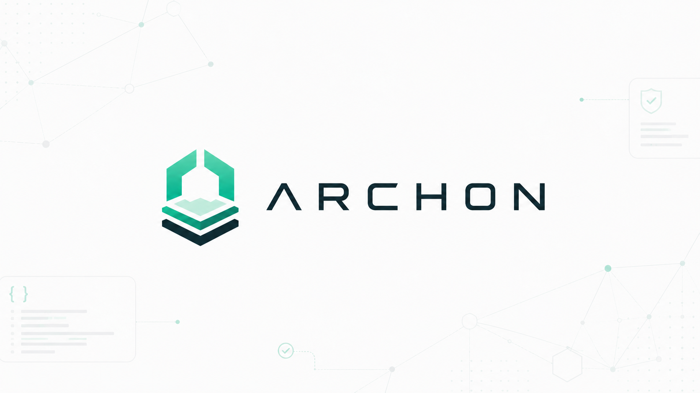
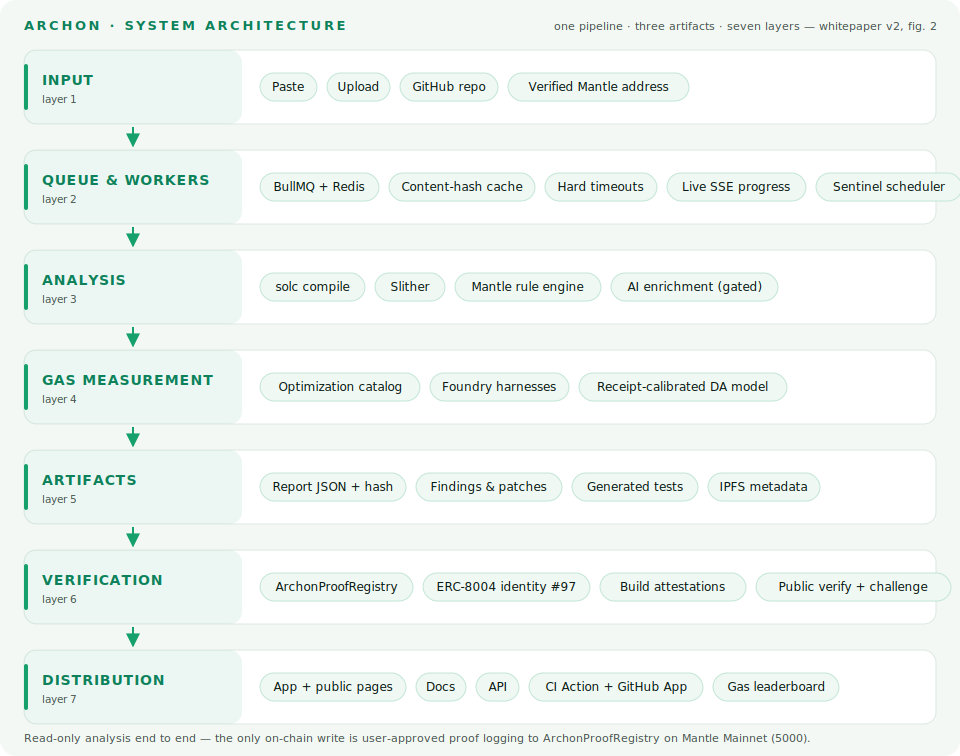
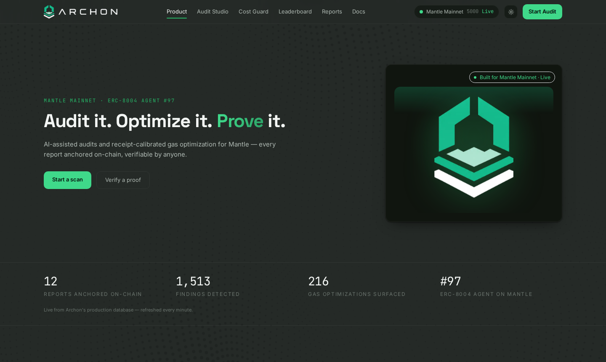
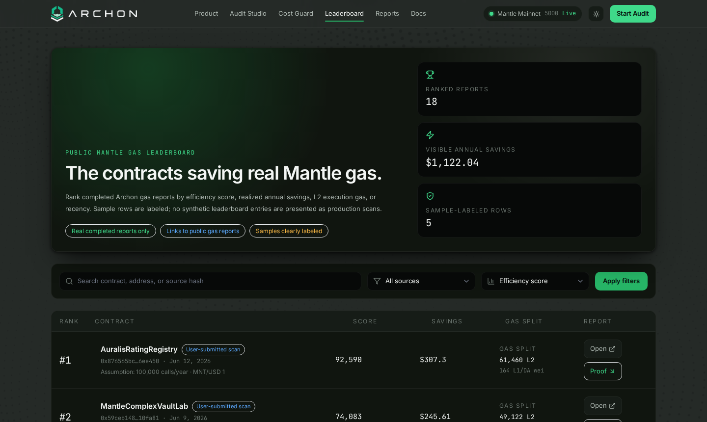
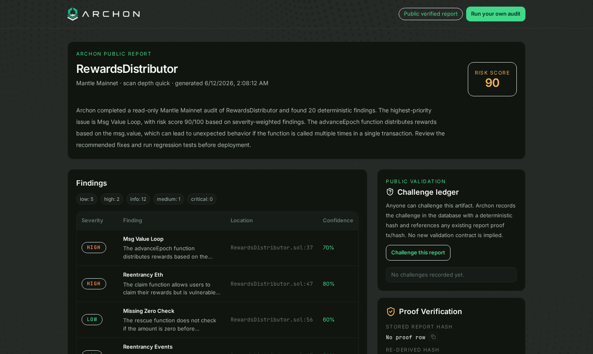

<p align="center">
  
</p>

<h3 align="center">Audit it. Optimize it. Prove it.</h3>
<p align="center"><strong>The verifiable DevTools layer for Mantle</strong> — AI-assisted smart-contract audits, receipt-calibrated gas optimization, and on-chain proof for every report.</p>

<p align="center">
  <a href="https://github.com/Franlinozz/Archon/actions/workflows/ci.yml"></a>
  
  <a href="https://archonaudit.xyz/.well-known/archon-agent.json"></a>
  <a href="LICENSE"></a>
  <a href="https://archonaudit.xyz/whitepaper.pdf"></a>
</p>

---

## What Archon does

- **Audits** Solidity for Mantle: deterministic detection (solc + Slither + a Mantle-specific rule engine), bounded AI explanations, and generated Foundry regression tests — read-only, always.
- **Optimizes gas with receipts, not folklore:** every report splits L2 execution from data availability, priced from Mantle receipt ground truth (`l1Fee`) instead of the legacy oracle.
- **Proves it on-chain:** canonical report hashes anchor to ArchonProofRegistry under ERC-8004 Agent #97, and anyone can re-verify or challenge a report without a wallet.

## Live

| Surface | URL |
| --- | --- |
| App | <https://archonaudit.xyz> |
| Docs | <https://archonaudit.xyz/docs> |
| Whitepaper (PDF) | <https://archonaudit.xyz/whitepaper.pdf> |
| Gas leaderboard | <https://archonaudit.xyz/gas-leaderboard> |
| Example public report | <https://archonaudit.xyz/r/d37f46d6-aded-41fc-9215-900370300111> |
| Example proof tx | [`0x141e3973…c88c10b` on MantleScan](https://mantlescan.xyz/tx/0x141e3973a3dc4a5f8b2dec3c6bf0ed6f1f8132ba1be4e9b8086e0fab9c88c10b) |
| CI Action demo (real PRs) | [green run + gas comment](https://github.com/Franlinozz/archon-gas-action-demo/pull/1) · [red run on a regression](https://github.com/Franlinozz/archon-gas-action-demo/pull/2) |

## Architecture



One pipeline, three artifacts (audit report, gas report, on-chain proof), seven independently improvable layers. Full detail in the [whitepaper](https://archonaudit.xyz/whitepaper.pdf) (§03) and [docs](https://archonaudit.xyz/docs).

## Deployed contracts (Mantle Mainnet · 5000)

| Contract | Address | Notes |
| --- | --- | --- |
| **ArchonProofRegistry** | [`0xe7043e2ec95eF357FbBa3359BA2f1edb10cEAD2a`](https://mantlescan.xyz/address/0xe7043e2ec95eF357FbBa3359BA2f1edb10cEAD2a#code) | Archon's own proof anchor — **verified source**. `logAuditProof()` publishes the deterministic report hash + IPFS metadata URI + risk score; permissionless and idempotent per hash. Deploy tx [`0xb9ce87de…a1a7c5`](https://mantlescan.xyz/tx/0xb9ce87de86b212b91eb64012bbdab91014373da1f6d960470b340e1991a1a7c5), example proof tx [`0x82d99588…088ef`](https://mantlescan.xyz/tx/0x82d99588e5f1bff33d618743025d598445493032637de25844a67aa8e88088ef). Source + Foundry tests: `contracts/`. |
| ERC-8004 Identity Registry | [`0x8004A169FB4a3325136EB29fA0ceB6D2e539a432`](https://mantlescan.xyz/address/0x8004A169FB4a3325136EB29fA0ceB6D2e539a432) | Official registry; Archon is **Agent #97** ([manifest](https://archonaudit.xyz/.well-known/archon-agent.json)). |
| ERC-8004 Reputation Registry | [`0x8004BAa17C55a88189AE136b182e5fdA19dE9b63`](https://mantlescan.xyz/address/0x8004BAa17C55a88189AE136b182e5fdA19dE9b63) | Official registry; holds Archon's earlier reputation-anchored proof records. |

## Why our DA numbers are receipt-calibrated

On live Mantle transactions, the legacy `GasPriceOracle.getL1Fee` **under-reports the DA fee the chain actually charges by ~99.96%** — the receipt `l1Fee` was ≈2,200–2,900× the oracle's prediction (measured 99.955% / 99.966% divergence on two real txs).
Any tool quoting the oracle is invisibly wrong about Mantle's DA economics.
So Archon prices DA from receipt ground truth — a calibrated zero/nonzero-calldata-byte model validated against live transactions — and labels every figure as **measured, estimated, or unpriced**.
Methodology, tx hashes, and validation error: [ADR 0007](docs/decisions/0007-mantle-gas-oracle-verification.md) · whitepaper v2 §05, Table 1.

## Feature matrix

| Capability | What you get | Where |
| --- | --- | --- |
| **Audit** | Severity-ranked findings with file/line evidence, Mantle-specific risk, AI explanations, generated Foundry tests | [Audit Studio](https://archonaudit.xyz/app/audit/new) |
| **Gas** | Optimization catalog, validated patches, receipt-calibrated L2/DA split, annualized savings under stated assumptions | [Gas Optimizer](https://archonaudit.xyz/app/gas) |
| **Proof** | Canonical hash anchored to ArchonProofRegistry; public, wallet-free verification | [/proofs](https://archonaudit.xyz/proofs) |
| **CI** | `archon-scan` CLI with `--fail-on` gates + GitHub Action posting real gas-diff PR comments | [CLI docs](https://archonaudit.xyz/docs/platform-api/cli) · [Action docs](https://archonaudit.xyz/docs/gas-optimizer/ci-github-action) |
| **Leaderboard** | Public ranking of completed gas reports (sample rows labeled) | [/gas-leaderboard](https://archonaudit.xyz/gas-leaderboard) |
| **Challenge** | Public challenge records against reports and optimizations | [Security & safety model](https://archonaudit.xyz/docs/resources/security-safety-model) |
| **Sentinel** | Continuous audit of deployed contracts: drift detection (bytecode, EIP-1967, owner), auto re-scans with findings diff, audit-freshness scores, webhook alerts | [Sentinel docs](https://archonaudit.xyz/docs/audit/sentinel) |
| **Verified builds** | Deterministic attestation that deployed bytecode matches claimed source (immutables masked, metadata-aware), with public verification pages and anchorable hashes | [Verified builds docs](https://archonaudit.xyz/docs/on-chain-proofs/verified-builds) |

## Quickstart

**Use the app:** open <https://archonaudit.xyz>, click **Start Audit**, paste Solidity or import from GitHub/address.

**CLI** (zero dependencies, Node ≥ 18):

```bash
npx --yes github:Franlinozz/archon-cli scan contracts/Vault.sol --gas --fail-on high
```

**GitHub Action** (PR gas-diff comments with L2 + DA columns):

```yaml
permissions: { contents: read, pull-requests: write }
steps:
  - uses: actions/checkout@v4
  - uses: Franlinozz/Archon@main
    with:
      source-file: contracts/YourContract.sol
      github-token: ${{ secrets.GITHUB_TOKEN }}
```

**API:** OpenAPI 3.1 at [/api/openapi](https://archonaudit.xyz/api/openapi), interactive reference at [/api-reference](https://archonaudit.xyz/api-reference).

## Tech stack

Next.js 15 · TypeScript · Tailwind · BullMQ + Redis · Supabase Postgres · solc/Slither · Foundry · viem/wagmi · pluggable AI providers (OpenAI live; ELFA & Tencent Cloud Hunyuan adapters built-in, [status](https://archonaudit.xyz/api/providers)) · Pinata/IPFS (+ Tencent COS backup adapter) · PM2 + Caddy on one VM.

The scan pipeline is read-only. The only intended transaction path is the explicit user-approved proof log, guarded by simulation and cost checks.

## Hackathon

Built for the **Tencent Cloud × Mantle** hackathon (Cookathon). Archon ships its **own** on-chain proof contract as the primary, award-eligible deployment: **ArchonProofRegistry** (verified on MantleScan, table above) — `logAuditProof()` publishes the AI inference result on-chain (deterministic report hash + IPFS metadata URI + AI-derived risk score), permissionless and idempotent per report hash, so both gasless and self-custody proof paths work without the ERC-8004 self-feedback restriction. AI enrichment and artifact storage run on a [pluggable provider layer](https://archonaudit.xyz/docs/platform-api/cloud-providers) with first-class Tencent Cloud (Hunyuan, COS) adapters.

## Screenshots

| | |
| --- | --- |
|  |  |



## Local development

```bash
pnpm install
cp .env.example .env.local   # set DATABASE_URL, REDIS_URL, Mantle RPC
pnpm dev                     # web app
pnpm worker                  # scan worker
```

Optional: `OPENAI_API_KEY` (or `AI_PROVIDER` + the matching key) for live AI enrichment — deterministic fallback keeps the app usable without it; `IPFS_PIN_TOKEN` for proof metadata pinning.

**Verification gates:** `pnpm typecheck · lint · test · secret-scan · scope-grep · build` — CI runs the same set.

## Repository map

```text
app/                    Next.js app + API routes (app/r/[reportId] = public report viewer)
components/             UI components (archon/, marketing/, nav/, docs/, theme/)
contracts/              ArchonProofRegistry (Foundry) + sample inputs and fixtures
docs/                   architecture assets, ADRs, DOC-SYNC ritual, whitepaper, submission notes
lib/                    scan pipeline, gas engine, proof layer, AI providers, chain helpers
packages/cli/           archon-scan CLI (mirrored to Franlinozz/archon-cli for npx)
worker/                 BullMQ scan worker entrypoint
action.yml              the Archon Gas Action (composite)
```

## Contributing & license

Issues and PRs are welcome — run the verification gates before submitting. Licensed [MIT](LICENSE).
